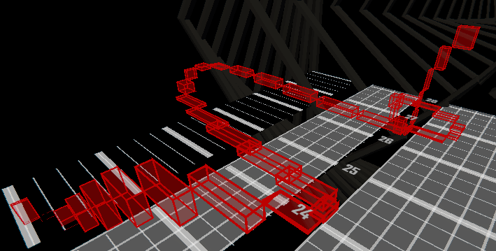
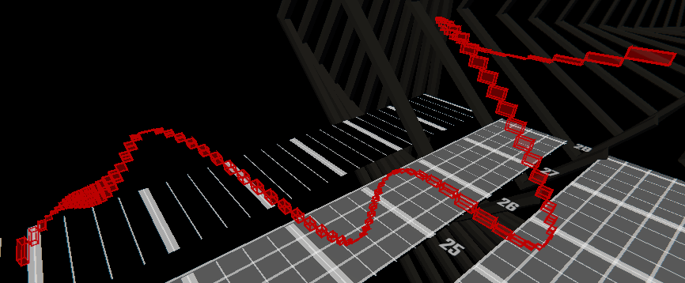
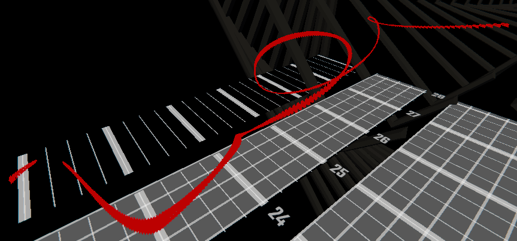

# RandomCurve

[Video](https://youtu.be/Choj5yLke1A) In game view of these examples ~~not exact because I didn't seed them~~

Random curves are controlled by two points, start and end.

**Warning: These do not respect the player space, be careful of causing vision issues**, `seed` might be an option to help avoid this.


## Example 1



```yaml
# RandomCurve creates a, well, random curve between two points.
# Useful during slower parts of a song where you don't need to have specific curve.
# Or if you're lazy using short ones during faster parts is an option.
20:RandomCurve
    p1:-5,1,0       # start point is 5 blocks to the left, 1 block high, and starts at the same time it's placed at (20 in this case)
    p2:5,6,5        # end point is 5 blocks to the right, 6 block high, and ends 5 beats from the start
```

--- 

## Example 2



```yaml
# That looks a bit blocky, lets make it a bit smoother.
20:RandomCurve
    p1:-5,1,0
    p2:5,6,5
    amount:20       # Will control the number of walls per beat, making the curve appear smoother.
```

--- 

## Example 3



```yaml
# Still too blocky for you? Lets bump it up a little, and by a little I mean a lot.
20:RandomCurve
    p1:-5,1,0
    p2:5,6,5
    amount:100

# Wait no, go back!
```

--- 

## Example 4


```yaml
# The flexibility of Beatwalls allows you to add some modifers to this.
# Lets make these hyper walls (Exact numbers vary on halfjump)
20:RandomCurve
    p1:-5,1,0
    p2:5,6,5
    amount:120
    changeDuration:-2

# Nyyyoommm
```
