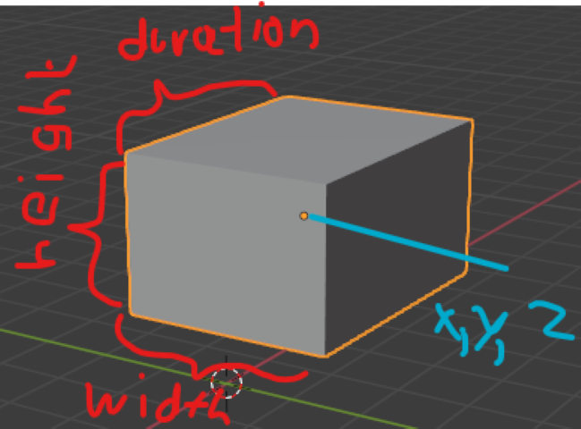

# Quickstart

Ever played a wallmap and thought.


__OH BOY DO I HAVE THE TOOL FOR YOU__

__Beatwalls__ is a program designed to make wallmaps with thousands of wall possible.
It tries to make them __easy and fast__ to create and change.
It is not however the tool if you are looking for spelling, 3d modelling or animations.
For that check out [Nyri0s scripts](https://github.com/Nyrio/beat-saber-mapping-scripts/tree/7456bedb00371914ed27e28ebc3cf28f0b4b42e5)

While i have your full attention, I want to thank these people:
- Bloodcloak, who put up with my spelling and helped me write this documentary.
- Aero, who wrote Noodle Extensions and 
- CheckThePan and nyri0, who helped me with a lot of math
- Reaxt and CyanSnow who showed us what can be possible with modcharts

## Installation

### Tools

- install [java](https://java.com/en/download/)
- install [mma2](https://bsmg.wiki/mapping/mediocre-map-assistant.html#editor-setup)
- download [beatwalls](https://github.com/spookyGh0st/beatwalls/releases/)

### mods
::: tip Info
can be installed through modAssistant, 
or [manually](https://bsmg.wiki/pc-modding.html#install-mods)
:::

- required: [Noodle Extension](https://github.com/Aeroluna/NoodleExtensions) - allows for wallmaps
- recommended: [Chroma](https://github.com/Aeroluna/chroma) - lets you color your walls
- highly recommended: [FPFCToggle and Songcontrol](https://github.com/Auros/SiraUtil#songcontrol) - lets you look at the map without vr
- ~~highly recommended:~~ currently not working [ReLoader](https://github.com/Kylemc1413/ReLoader) - hot reloads the map from the pause menu
- highly recommended: [PracticePlugin](https://github.com/Kylemc1413/PracticePlugin) - change Song time, playback speed and more from the pause manu

## Setup

It is __highly__ recommended using a sepate difficulty for your generated Walls.
This difficulty will hold all the Elements that are being created.
For that, it will need the requirement `Noodle Extensions` or `Mapping Extensions` as well as `Chroma`.
You can learn on how to set up the map in the [bsmg.wiki](https://bsmg.wiki/mapping/extended-mapping.html#set-up).

::: warning Info
currently you have to copy the walls into the final version manually with json editing.
::: 

## Usage

Drag a Song Folder into the .exe to launch the configuration setup. 
It will create the main.bw File in your song folder. Open this in any text editor, I recommended Visual Studio Code.
This File defines the created Structures for the selected difficulty, like a cookbook.

Once beatwalls is running, it will listen to all changes to the main.bw file.
So whenever you change a section and hit save, it will create the new walls.

After the program has been set up, it can be started again simply by double clicking the .exe.
When you want to change the map, drag the new song folder in the application and repeat the setup.

::: danger
Beatwalls will replace **ALL NOTES, OBSTACLES AND EVENTS** in the difficulty.
Don't edit those manually, as they will be overwritten.
:::

## Overview

### WallStructure 

A Structure is a collection of walls ~~Notes or lights~~ (planned for the future).
Bundling them together allows one to  edit and repeat them all at once to fit the Song, without having to manually edit each wall. 

### Coordinate System

To make working with Walls easier, I introduce to you a new [standard](https://xkcd.com/927) of Values, which define a wall. It defines 1 = one block.


A wall is defined by `x,y,z,width,height,duration`.
The Position is in the **center** of the Wall.



::: tip Info
`z` and `duration` are measured in beats.
Look at a different mapper (mma2) for those.
:::

## Hello Wall

Now let`s create our first Structure
Open Beatwalls and leave it running.
Now write this into you .bw file.

```yaml
# creates a noodle Helix at beat 10
Helix:
    beat: 10
    duration: 2
```

Lets see what happens in this example
 * Lines starting with a `#` are comments and get ignored.
 * `Helix` creates a Helix 
 * `beat: 10` lets the helix on beat 10
 * `duration: 2` The complete helix will have a duration of 2
 
Now open Beatsaber and reload the songs with **ctrl - r**.
Start your map, and you should see the Structure appearing timed to beat 10


 
::: warning Timing
Beatwalls automatically makes sure your Structures __apear__ and not zoom past you at the specific beat.
::: 

## Gotchas before we move on

- Beatwalls is ***NOT*** case-sensitive
- Beatwalls does ***NOT*** care about spaces or tabs but it does care about newlines
- Beatwalls works with BEATS (the thing in mm) and not TIMES, it takes care of the bpm changes found in mma2
- Beatwalls has ***NO*** complete Syntax checker currently and might crash when something weird happens. Please write me when it does.
    